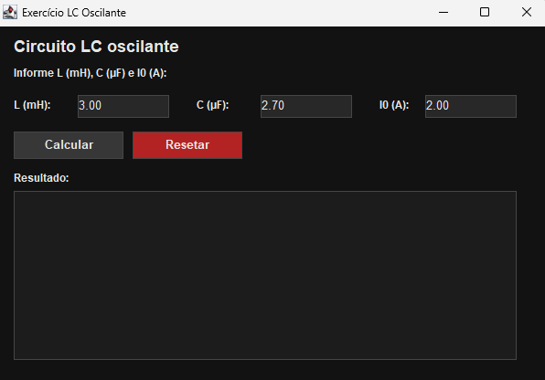
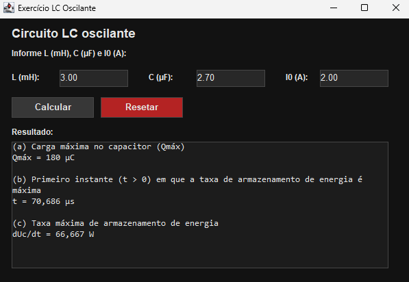

# ⚡ Cálculo de Circuito LC (Java + Swing)

Este projeto resolve um exercício de circuito **LC oscilante** usando **Java** com interface gráfica em **Java Swing**.

---

## 📌 Sobre o exercício

Considere um circuito LC ideal com:

- **L = 3,00 mH**
- **C = 2,70 µF**

No instante inicial (**t = 0**):

- **carga do capacitor = 0**
- **corrente inicial i(0) = 2,00 A**

### Objetivos

Determinar:

1. A **carga máxima** do capacitor;
2. O **primeiro instante (t > 0)** em que a taxa de armazenamento de energia no capacitor é máxima;
3. O **valor da taxa máxima** de armazenamento de energia.

---

## 🧠 Modelo físico aplicado

Para um circuito LC sem perdas (sem resistência), a energia total é conservada:

`U = q²/(2C) + Li²/2`

A frequência angular natural é:

`ω = 1/√(LC)`

Com as condições iniciais `q(0)=0` e `i(0)=I0`:

- `q(t) = Qmáx · sen(ωt)`
- `i(t) = I0 · cos(ωt)`
- `Qmáx = I0 · √(LC)`

Energia no capacitor:

`Uc(t) = q²(t)/(2C)`

Taxa de armazenamento de energia no capacitor:

`dUc/dt = (q · i)/C`

Forma equivalente:

`dUc/dt = (Qmáx · I0 / (2C)) · sen(2ωt)`

---

## 🧮 Resultados obtidos

### Dados em SI

- `L = 3,00 × 10⁻³ H`
- `C = 2,70 × 10⁻⁶ F`
- `I0 = 2,00 A`

### 1) Carga máxima

`Qmáx = I0 · √(LC)`

➡ **Qmáx ≈ 1,80 × 10⁻⁴ C = 180 µC**

### 2) Primeiro instante de taxa máxima

A primeira taxa máxima ocorre quando:

`sen(2ωt) = 1  =>  t = π/(4ω)`

Com `ω ≈ 1,11 × 10⁴ rad/s`:

➡ **t ≈ 7,07 × 10⁻⁵ s = 70,7 µs**

### 3) Taxa máxima de armazenamento

`(dUc/dt)máx = (Qmáx · I0)/(2C)`

➡ **(dUc/dt)máx ≈ 66,7 W**

---

## 🖼️ Fotos do programa

---

## 🖥️ Tecnologias e bibliotecas utilizadas

### Linguagem
- **Java**

### Interface gráfica
- **Java Swing** (`javax.swing`) ✅

### Bibliotecas padrão da JDK usadas no cálculo
- `java.lang.Math`
  - `Math.sqrt(...)`
  - `Math.PI`
  - (opcional) `Math.sin(...)` e `Math.cos(...)`
- `System.out.printf(...)` (saída formatada, quando aplicável)

> Este projeto não depende de bibliotecas externas (Maven/Gradle) para os cálculos principais.

---

## ✅ Resumo final

- **Carga máxima do capacitor:** `1,80 × 10⁻⁴ C` (**180 µC**)
- **Primeiro instante de taxa máxima:** `7,07 × 10⁻⁵ s` (**70,7 µs**)
- **Taxa máxima de armazenamento de energia:** `66,7 W`
